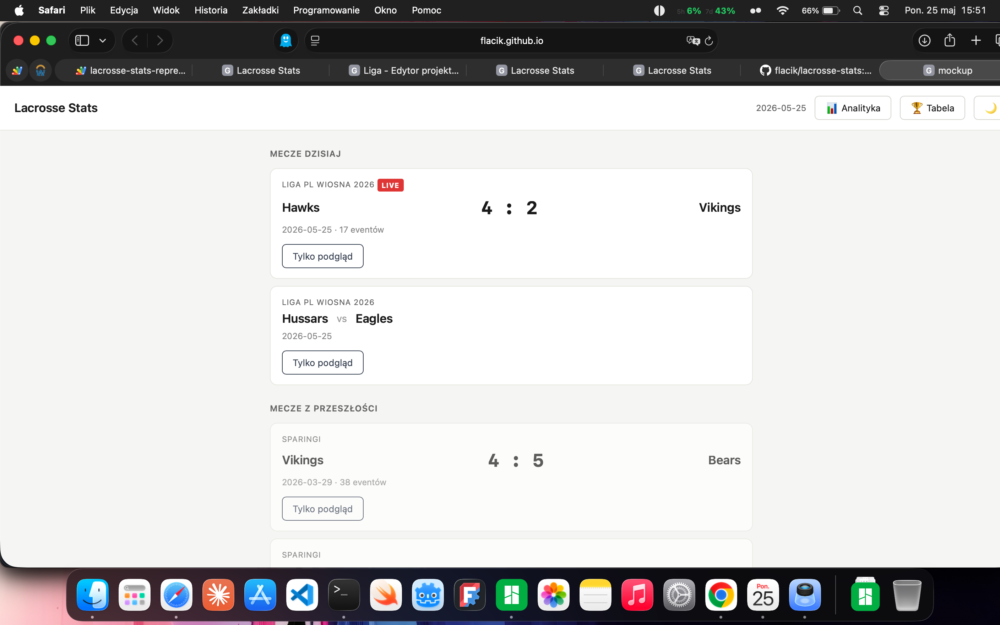

# Lacrosse Stats


A web application for recording shot statistics during lacrosse matches, with a real-time viewer mode for coaches.

**Live demo (sample data):** https://flacik.github.io/lacrosse-stats/

> The demo runs entirely in the browser with built-in sample data — no login or Google account needed.
> The production app (connected to a real Google Sheets database) is used by clubs internally.

---

## Preview



---

## What it does

During a lacrosse match, one person (scorer) records every shot by tapping the position on an interactive field map directly in the browser. At the same time, the coach can open the same match on a tablet and see live statistics updating every 5 seconds — no page refresh needed.

All data is stored in Google Sheets, so the club always has a permanent record of every shot from every match.

---

## Features

**Dark mode**
- Toggle button in every screen header switches between light and Night Blue dark theme
- Preference persisted in `localStorage` — survives page reload and navigation between screens

**Shot recording (input mode)**
- Tap the SVG field map to place a shot; a modal confirms result (goal / missed / saved / post) and other details (man-up, man-down, period, assist, **fast break**)
- Full shot history with inline edit and delete; newest events at the top
- Sync badge on each event shows whether it's been saved to the backend (✓ synced / ⚠ error / retrying)
- Offline buffer — if the network drops, shots are queued locally and auto-retried with exponential backoff (1 s → 3 s → 9 s)
- **Offline recovery** — pending events survive page refresh/close and are restored from `localStorage` on next load
- **Undo delete** — 5-second undo toast after deleting a shot; event re-syncs if undo is not used
- **Presence indicator** — 👤 N badge in the header shows how many other editors are currently in the same match; heartbeat every 30 s, identity scoped per browser tab

**Live viewer mode (coach)**
- Score, team stats, goalie stats, and per-period breakdown
- Shot chart: full-field overview + half-field zoom with heatmap overlay
- All coordinates stored in attacker-relative space (shot_x/shot_y ∈ [-1,1] / [0,1]) and converted to display coordinates on the fly
- Refreshes every 10 seconds; header shows exact time of last update
- **Presence indicator** — 👤 N badge shows how many editors are currently active in the match
- "▶ Recording" button in the match bar when a recording URL is set

**Analytics screen**
- Tournament / team / date / period filters; team dropdown scoped to selected tournament
- Stats grid: **match count**, shots, goals, accuracy %, man-up/down, zone breakdown, per-period breakdown; all values update with active filters
- Donut chart of shot results; bar chart of accuracy per period
- Man-up / man-down / even-strength / **fast break** situation cards (hidden when no relevant events)
- Shot chart with three modes: fired shots, conceded shots, zone efficiency heatmap
- **Goalie ranking** — cross-match save% per goalkeeper, with per-quarter breakdown; visible for all teams (no filter) or scoped to a selected team
- **Team comparison mode** — select two teams side by side; shows attack/defense comparison table (with best-value highlighting), dual shot charts, head-to-head match history with W/D/L summary and H2H stats, goalie cards per team, and per-quarter accuracy charts

**Admin panel**
- Create and manage tournaments
- Schedule matches (date, teams, venue, optional recording/stream URL); filter by tournament, date range, and status
- CSV bulk import — upload a file (up to 200 rows), preview table, one-click import; auto-detects `,` or `;` separator and header row
- Matches flow automatically into the home screen for scorers to pick up
- **Presence badges on match list** — 👤 N badge on each match card when other editors are currently inside that match

---

## Live deployments

| Instance | Access | URL |
|---|---|---|
| Demo (sample data) | Public, view-only | https://flacik.github.io/lacrosse-stats/ |
| Reprezentacja (Polish National Team) | Anyone with the link — full editor access | internal |
| Liga (Polish Lacrosse League) | Viewer: anyone with the link · Editor: `?token=TOKEN` | internal |
| Mistrzostwa (World Championship, field lacrosse) | Anyone with the link — full editor access | internal |

---

## Tech stack

| Layer | Technology |
|---|---|
| Frontend | Vanilla JS (ES6), HTML5, CSS3 |
| Backend | Google Apps Script (GAS) |
| Database | Google Sheets (3 tabs: events, scheduled_matches, tournaments) |
| Hosting | Google Apps Script Web App (prod) + GitHub Pages (demo) |
| Build | Shell script → single self-contained `dist.html` |

---

## Architecture

The frontend is split into 17 focused modules (each under 300 lines), loaded in dependency order:

```
gas-client → helpers → data → algorithms → stats → state → i18n
→ field-svg → render-* → handlers → app
```

Key design decisions:

- **Modular JS without a framework** — each module has a single responsibility; the entire app bundles into one HTML file via `build.sh`
- **Optimistic UI** — events appear in the history immediately; GAS sync happens in the background with status feedback
- **GAS response contract** — the backend always returns `{ ok: true, data }` or `{ ok: false, error: { code, message } }`; it never throws to the client
- **Attacker-relative coordinates** — shot positions are stored relative to the attacking direction, not the physical field orientation, so stats are comparable regardless of which half each team attacked
- **Rate limiting** — the backend enforces max 50 writes per minute per session via `CacheService`
- **CSP-safe event handling** — no inline `onclick`; all actions use `data-action` attributes and a single delegated listener

---

## Data storage

Three Google Sheets tabs:

| Tab | What's stored |
|---|---|
| `events` | Every shot: match_id, team, period, result, coordinates, timestamps |
| `scheduled_matches` | Match schedule: date, teams, tournament, status, video_url |
| `tournaments` | Tournament registry |

Backend spreadsheet: https://docs.google.com/spreadsheets/d/1nrNDjbIFX6Ac-eMXmUe7mlh8RC1bkXWWcq_gaUULvio

---

## Project structure

```
src/                       ← frontend (16 JS modules + CSS)
  build.sh                 ← bundles everything into dist.html
  *.js / styles.css        ← source modules
backend/
  reprezentacja/           ← GAS backend — Polish National Team
    Code.gs                ← all server-side functions
    appsscript.json
  liga/                    ← GAS backend — Polish Lacrosse League
    Code.gs                ← same backend, separate spreadsheet + viewer token
    appsscript.json
docs/                      ← GitHub Pages demo (auto-updated by build.sh)
templates/
  mecze-template.xlsx      ← Excel template for CSV bulk import
```

---

## How to run locally

Open `src/index.html` in a browser. The app starts in dev mode (`IS_GAS: false`) with sample data — no backend connection needed for UI development.

To build the production bundle:

```bash
cd src/
./build.sh
# → generates src/dist.html and copies to docs/index.html
```

---

## Status

**Current: v2.3.3 — deployed 2026-06-10**

### Versioning rules

| Digit | When to bump |
|---|---|
| **MAJOR** | Sheets schema change (add/remove column) that requires a data migration |
| **MINOR** | New user-facing feature or screen |
| **PATCH** | Bug fix, UI tweak, performance improvement |

### Changelog

Each entry is tagged with the deployment(s) it affects: `[all]` ships to every deployment (liga, reprezentacja, mistrzostwa, demo), `[mistrzostwa]` is field-lacrosse-only, `[liga]`/`[reprezentacja]` are box-lacrosse-only. Untagged legacy entries below predate the multi-deployment split and applied to all instances.

**v2.3.4 (2026-07-15)** `[all]` — analytics PDF report: per-match readability:

- New "quarter comparison across matches" table in the team analytics PDF — one row per match so the same quarter (Q1, Q2…) can be compared across a whole tournament at a glance, plus a totals row
- Team analytics PDF shot chart: once a filter spans more than one match, the single combined shot map (which turned into an unreadable pile of markers) is replaced by one small offense/defense map per match, labeled by opponent and date

**v2.3.3 (2026-06-10)** — heatmap and PDF legend translation fix:

- Shot chart legend labels (Goal, On target, Off target, Assisted, Man-up, Man-down, Fast break) now use the active language — previously always rendered in Polish regardless of the selected language
- Attack direction subtitle on half-field charts ("attack ↑ (goal at top)") and the canonical-view note on full-field charts now translate correctly in EN mode
- Applies to both the live viewer and the PDF shot chart page

**v2.3.2 (2026-06-09)** — PDF shot chart improvements:

- Match report shot chart reduced from 4 maps to 2 — one per team (shots fired), side by side; "shots conceded" maps removed as they were duplicates of the opposing team's "shots fired"
- Shot chart in PDF now shows individual markers (goal = filled circle, on-target = open circle, off-target = X) with a legend, replacing the heatmap view

**v2.3.1 (2026-06-09)** — bug fix:

- Fixed off-target shots (`niecelny`) rendering as circles instead of X markers on the live match field map; they now display consistently with the legend and the analytics view

**v2.3.0 (2026-06-09)** — full bilingual PL/EN support:

- Runtime language toggle button (🇬🇧 / 🇵🇱) in every screen header — switches the entire UI between Polish and English without a page reload
- Language preference persisted in `localStorage` (`lax_lang`); default is Polish
- New `src/i18n.js` module — ~200 translation keys per language, three helpers: `T(key)`, `T_n(n, singKey, plurKey)` (2-form plural), `T_match(n)` (3-form Polish plural for match counts)
- All 10 render modules rewritten: `render-home`, `render-input`, `render-modal`, `render-viewer`, `render-analytics`, `render-admin`, `render-standings`, `render-report`, `helpers`, `stats`
- Period labels locale-aware: "Dogrywka 1" in PL, "OT 1" in EN
- PDF reports generated in whichever language is active at export time
- Analytics computed labels (situations, zones) evaluated at runtime — language-correct when rendered

**v2.2.0 (2026-06-09)** — team comparison in analytics:

- New **"Team comparison"** tab in the analytics screen; mode toggle switches between single-team analysis and two-team comparison without losing filter state
- Filter bar switches to "Team 1" / "Team 2" selectors in comparison mode; tournament / period / date filters apply to both teams equally
- **Overall comparison table** — three-column layout (team1 | metric | team2) with green highlighting on the better value; covers attack (shots, goals, accuracy, on-target %, man-up, man-down, fast break) and defense (shots conceded, goals conceded, opponent accuracy)
- **Dual shot charts** — both teams' heatmaps rendered side by side; toggle between fired shots, conceded shots, and zone efficiency heatmap applies to both simultaneously
- **Head-to-head section** — W/D/L summary with large counters, full match history table for their mutual matches, and a separate H2H stats comparison (goals, shots, accuracy)
- **Goalie comparison** — avg save% card + top-4 goalie table for each team rendered in two columns
- **Per-quarter accuracy charts** — both teams' period bar charts side by side

**v2.1.0 (2026-06-08)** — PDF reports:

- New **⬇ PDF** button in the match viewer and analytics screens
- Match report: shot chart section shows two heatmaps side by side per team — shots taken (blue) and shots conceded (red = opponent color)
- Analytics report: when a team is filtered, shows the same two-heatmap layout — shots taken and shots conceded aggregated across all filtered matches
- Report includes shot stats, special situations, goalies, per-period breakdown, and match history (analytics only)

**v2.0.0 (2026-06-08)** — fast break tracking (Sheets schema change):

- New `fast_break` boolean flag on every shot event — checkbox in both the shot modal and the edit-event modal
- Fast break arrow indicator (`→`) on the field map in all views (input, viewer, analytics); white outline ensures visibility on the green field background
- `FB` badge in the shot history list
- Fast break situation card added to the "Special situations" section in the viewer and analytics screens
- Fast break stat box in the analytics summary (shots, accuracy)
- `fast_break` column added to the Sheets event schema (position 18, after `assisted`)
- Fast break legend entry on every field map

**v1.13.1 (2026-05-27)** — presence mode distinction (input vs viewer):

- Presence badge now shows two separate counts: ✏️ N (editors in input mode, yellow) and 👁 N (viewers in viewer mode, green); self is excluded from the relevant count
- Viewer mode also sends a heartbeat every 30 seconds

**v1.13.0 (2026-05-27)** — presence indicators:

- **Presence badge on match list** — each match card shows a 👤 N badge when N > 0 editors are currently in that match; uses CacheService batch query so home-screen load has one extra GAS call
- **Presence indicator in input mode** — the header shows how many *other* editors are in the same match (self excluded); heartbeat sent every 30 seconds
- **Presence indicator in viewer mode** — match-info-bar shows editor count, updated on each 10s viewer refresh
- **Tab-scoped identity** — SESSION_ID generated per browser tab via `sessionStorage`; presence disappears when the tab closes (2-minute staleness + 300s cache TTL)

**v1.12.0 (2026-05-27)** — period picker with side memory:

- **Period picker** — small ▾ button next to "Next period" opens a quarter selector (Q1–Q4, OT1–OT2); the app remembers which side team A was on for each visited quarter and restores the correct sides when switching; for unvisited quarters, calculates automatically based on the Q1 starting side
- Picker changes enter the undo system (8s) — the Undo banner works identically to next-period

**v1.11.1 (2026-05-27)** — undo queue for quarter changes:

- **Undo queue for quarter changes** — multiple "Next period" clicks accumulate a change history; undo always restores the state before all accidental clicks (not just one step back), identical to undo-delete for events

**v1.11.0 (2026-05-27)** — doPost JSON API:

- **JSON API via doPost** — backend handles `POST` requests with `Content-Type: application/json`; enables endpoint testing with tools like Postman without using `google.script.run`

**v1.10.0 (2026-05-25)** — viewer-only deployment mode, multi-project support:

- **Viewer-only mode** — deployments can be restricted to read-only: no "Input stats", no admin panel, no ad-hoc match button; controlled by `EDITOR_TOKEN` in GAS Script Properties; if the token is not set, full access is granted to everyone (backwards-compatible)
- **Token-based access** — editor URL includes `?token=TOKEN`; viewer URL has no token; same deployment ID, same codebase
- **Two independent GAS projects** — Polish National Team (`gas/`) and Polish Lacrosse League (`gas-liga/`) each connect to their own Google Sheets spreadsheet; frontend code is shared via a single `dist.html` build
- **Route guard** — navigating to input or admin screens without editor access is silently redirected to home
- **GitHub Pages demo** defaults to viewer mode (no `APP_CONFIG` injected outside GAS)

**v1.9.1 (2026-05-24)** — analytics match count tile, assist in legend and viewer badge:

- **Match count tile in analytics** — new stat box to the left of the Shots counter showing the number of distinct matches included in the current filter selection; updates live with tournament / team / date / period filters
- **Assist badge in viewer mode** — yellow "A" badge on shot markers in the coach viewer shot chart (was already present in input mode)
- **Assist in shot map legend** — legend in both input and viewer modes includes the "A" (assist) marker

**v1.9.0 (2026-05-24)** — offline recovery, undo delete:

- **Offline event recovery** — if the app is closed or refreshed while events are pending in the offline buffer, they are restored from `localStorage` on next load and retried automatically; no shots are silently lost
- **Undo delete** — after deleting a shot, a toast notification appears with an "Undo" button; the event is restored locally and re-synced to the backend within 5 seconds
- **Shot ID sorting** — events in the viewer match list are sorted by numeric row ID, ensuring correct chronological order regardless of insertion timing

**v1.8.1 (2026-05-22)** — sortable goalie tables:

- All columns in the **Per Goalkeeper** table are now sortable by clicking the header: Goalkeeper (no.), Matches, Shots on goal, Saves, Goals conceded, Save%
- Quarter columns in the **Save% per Quarter** table are also sortable — click Q1/Q2/Q3/Q4 to rank goalies by that quarter's save%
- Both tables share the same sort key so goalie order is consistent between them
- Clicking the active column header toggles ascending ↑ / descending ↓; default is Save% descending

**v1.8.0 (2026-05-22)** — goalie analytics, UI polish, assist badge:

- **Goalie ranking in analytics** — new section below the stats grid showing cross-match save% per goalkeeper; grouped by goalie number per team; includes saves, goals against, shots on goal, match count, and a colour-coded save% bar; per-quarter breakdown table when multiple quarters exist; visible without team filter (all goalies) or scoped to a selected team
- **Assist badge** — yellow "A" badge on shot markers in the field map (input mode and viewer mode) and in the shot history list; legend updated
- **Scrollable shot history** — history panel scrolls vertically; newest events at the top (sorted by row ID descending); no horizontal scroll required
- **Zone column removed** from history rows — edit and delete buttons now always visible without scrolling
- **Dark mode field colors** — field SVG in dark mode uses dark green tones (`#1e2a1e` background, `#4a7a4a` lines)
- **In-app confirm modals** — delete confirmations no longer use the browser's native `confirm()` dialog; replaced with a styled modal matching the light/dark theme

**v1.7.0 (2026-05-20)** — assist flag + past matches on home screen:

- New **Assist** checkbox in the shot modal (alongside man-up/man-down) — marks whether a goal was assisted; shown as a blue badge in shot history
- Home screen now shows a **Past Matches** section below today's matches — past matches load and can be opened for stat entry
- GitHub Pages demo at https://flacik.github.io/lacrosse-stats/ — runs with sample data, no login needed

**v1.6.0 (2026-05-20)** — standings: tournament leaderboard:

- New **🏆 Standings** button on the home screen opens a per-tournament standings table
- Columns: Team / Matches / Goals+ / Goals− / On target / Off target / Efficiency % / Accuracy % / Man-up goals
- **Efficiency %** = goals / total shots; **Accuracy %** = (goals + on-target saves) / total shots
- Tournament dropdown — switch between all tournaments without leaving the screen
- Click any column header to sort ascending / descending (default: Goals+ descending)
- First-place row highlighted in green; Goals+ in green, Goals− in red
- `seedProdData()` helper in Code.gs — seeds PROD spreadsheet with 3 tournaments, 14 matches, ~480 events in one click from the GAS editor
- `mecze-template.xlsx` — Excel template for CSV bulk import (columns: tournament, date, team_a, team_b, link)

**v1.5.0 (2026-05-19)** — dark mode:

- Toggle button (🌙 / ☀) in every screen header (home, input, viewer, admin, analytics)
- Night Blue theme: `#0d1117` background, `#e6edf3` text, `#1c2128` cards — full coverage including analytics filters, stat boxes, donut/bar chart SVG labels, match history borders
- Preference stored in `localStorage` (`lax_theme`) and restored on every page load

**v1.4.0 (2026-05-19)** — CSV bulk import + video URLs:

- Admin panel: new **Import CSV** card — upload file, preview table, one-click import (up to 200 matches)
- CSV format: `tournament,date,team_a,team_b,link`; separator auto-detected (`,` or `;`), header row auto-detected
- GAS: `bulkCreateMatches()` batch-writes all rows in one `setValues` call
- New `video_url` field on every match — editable in the match modal, shown as "▶ recording" in the admin list
- Input screen: "▶ Recording" button in the match-info bar when a recording link is set
- `setupSheets()` now detects and adds missing columns (migration-safe, no manual sheet editing needed)
- `sanitizeUrl()` helper: only allows `http(s)`, strips control chars, max 500 chars

**v1.3.0 (2026-05-19)** — analytics visualizations:

- Donut chart of shot results (goal / saved / missed) with percentage breakdown
- Bar chart of goal accuracy per period (Q1…/OT1…) rendered alongside the period table
- Man-up / man-down / even-strength situation cards with goals, shots, and accuracy %; hidden when no relevant events exist
- Zone efficiency heatmap (3rd shot-chart mode): 6 zones coloured by goal % (grey → orange → green)

**v1.2.0 (2026-05-19)** — historical analytics screen:

- New **Analytics** screen (4th screen) with tournament / team / date / period filters
- Team dropdown scoped to selected tournament; resets on tournament change
- Stats grid: shots, goals, accuracy %, man-up/down, zone breakdown, per-period breakdown
- Shot chart heatmap — fired vs. conceded toggle, reuses the half-field SVG renderer
- Match history table with W/D/L colouring and viewer shortcut
- Backend: `listAllEvents()` + `seedDummyData()` (3 tournaments, 14 matches, ~563 events)

**v1.1.0 (2026-05-18)** — UI/UX redesign, frontend-only:

- LIVE badge redesign — red pulsing header bar when match is live, grey when finished
- Split bars in stats tables — proportional A vs B gradient under each row, toggleable
- Field map legend — goal / saved / missed markers with team colours (viewer mode)
- Zone labels A1–B6 on the field map (both input and viewer mode)
- Shot modal colour semantics — saved=blue, missed=grey, goal=green; larger man-up/down checkboxes
- Match card CTA hierarchy — "Input stats" primary, "View only" secondary; dominant score display
- Last-updated timestamp replacing "auto-refresh every 5s"
- Tablet responsive layout — two-column grid at ≥768px, fat-finger safe buttons (48px min)

**v1.0.0 (2026-05-15)** — production-ready baseline. Smoke tested against all 8 core scenarios: shot recording, real-time viewer, admin CRUD, offline buffer recovery, edit/delete flows.
